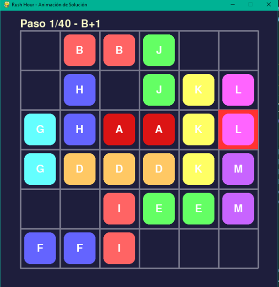

# Rush Hour
Proyecto para resolver el puzzle **Rush Hour** mediante algoritmos de búsqueda en espacio de estados (BFS, DFS, UC, Greedy y A*).

## Estructura del Proyecto

├── src/  
│   ├── estado.py          # Representación del estado del tablero  
│   ├── frontera.py        # Cola de prioridad para la búsqueda  
│   ├── graphic.py         # Visualización gráfica animada con Pygame (funcionalidad adicional)  
│   ├── movimientos.py     # Generación de sucesores y aplicación de movimientos  
│   ├── nodo.py            # Nodos del árbol de búsqueda  
│   ├── solver.py          # Implementación de los algoritmos de búsqueda  
│   ├── tablero.py         # Conversión cadena ↔ tablero y funciones de impresión  
│   └── rushhour.py        # Punto de entrada con parser de argumentos  
├── README.md              # Esta guía  

El código fuente está organizado dentro de la carpeta `src/` para mayor limpieza.

## Requisitos

- Python 3.12 o superior
- Para la animación gráfica: **Pygame**

### Instalación de dependencias

```bash
pip install pygame
```
(No se requieren otras librerías externas).

## Uso
Ejecuta desde la raíz del repositorio:

```Bash
python src/rushhour.py <acción> [opciones]
```

### Acciones disponibles

- verify - Verifica la validez de un nivel
- question - Consultas sobre el estado (--whereis, --what, --size, --howmany, --goal, --move)
- successors - Lista los movimientos posibles desde un estado
- solver - Resuelve el puzzle

### Opciones de solver

- -s <estado>: cadena de exactamente 36 caracteres (obligatorio)
- --strategy: BFS, DFS, UC, GBF o AStar (obligatorio)
- --heuristic: 0, 1 o 2 (obligatorio para GBF y AStar)
- --depth: límite de profundidad (solo para DFS)
- --stats: muestra estadísticas detalladas (tiempo, nodos generados, expandidos, podados, profundidad máxima)
- --graphic: animación gráfica automática con Pygame (funcionalidad adicional)

## Funcionalidad Adicional: Animación Gráfica 

He implementado una animación gráfica automática que reproduce la solución completa como si estuvieras viendo una partida en tiempo real.

### Características:

- Ventana con tablero 6x6, cuadrícula y salida marcada en rojo.
- El coche rojo ('A') siempre aparece en rojo intenso.
- Animación automática paso a paso con una pausa breve entre cada movimiento.
- Al finalizar aparece un mensaje grande "¡RESUELTO!" en verde.
- Cierra la ventana o pulsa cualquier tecla para terminar.

### Uso:
Añade --graphic al comando solver:
```Bash
python src/rushhour.py solver -s "<estado_de_36_caracteres>" --strategy AStar --heuristic 2 --graphic
```

Ejemplos de puzzles listos para probar la animación gráfica 

**Costo Uniforme**:
```Bash
py -3.13 src/rushhour.py solver -s BBoJoooHoJKLGHAAKLGDDDKMooIEEMFFIooo --strategy UC --stats --graphic
```
(Así es exactamente como yo lo estoy ejecutando)

**BFS**:
```Bash
py -3.13 src/rushhour.py solver -s BBoJoooHoJKLGHAAKLGDDDKMooIEEMFFIooo --strategy BFS --graphic --stats
```

**DFS**:
```Bash
py -3.13 src/rushhour.py solver -s BBoJoooHoJKLGHAAKLGDDDKMooIEEMFFIooo --depth 40 --strategy DFS --stats --graphic
```

**AStar**:
```Bash
py -3.13 src/rushhour.py solver -s HBBCCCHDDKoMAAJKoMEEJFFMoIooLooIGGLo --strategy AStar --heuristic 2  --stats --graphic
```

Así es como debe visualizarse (Ejemplo DFS)
 

### Autor
***Ingrid Niveiro Ben***

Ingrid.niveiro@alu.uclm.es
